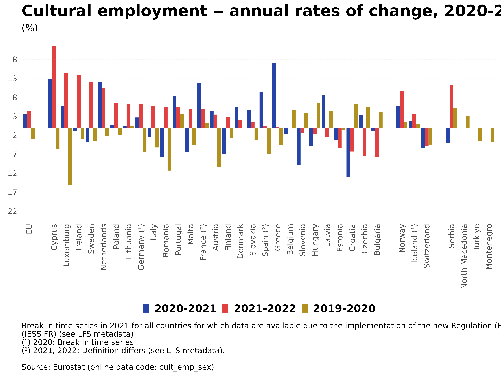
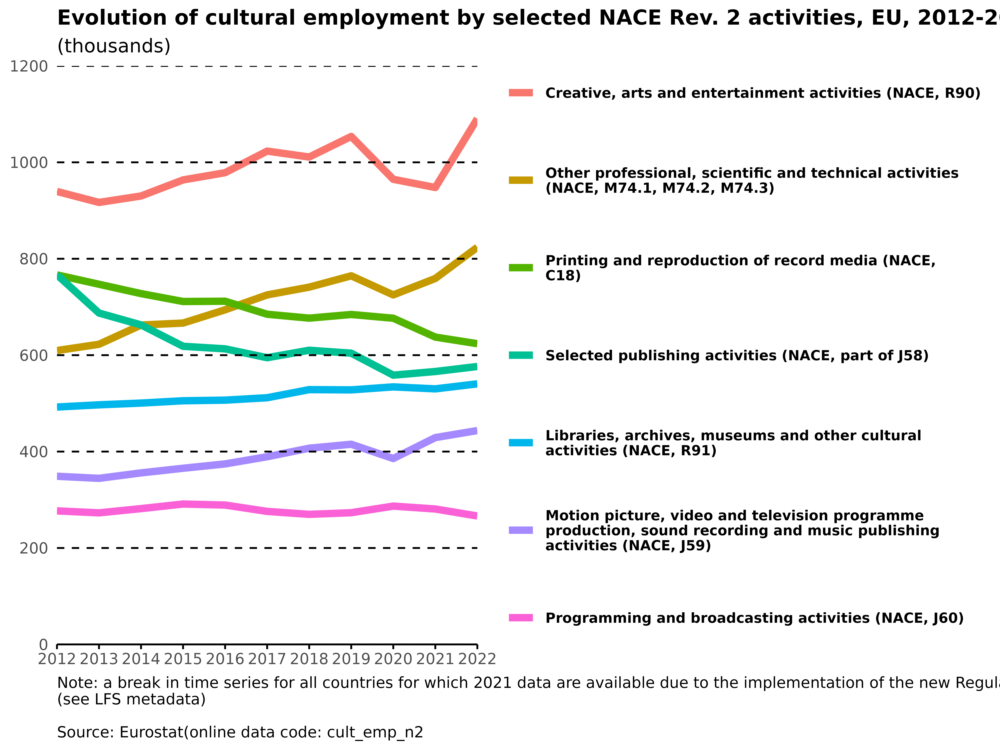

```{r setup, include=FALSE}
knitr::opts_chunk$set(echo = TRUE)
```


The following is a replicate of this statistics explained article: <https://ec.europa.eu/eurostat/statistics-explained/index.php?title=Culture_statistics_-_cultural_employment#Cultural_employment_.E2.80.93_current_state_and_latest_developments>

```{r}
# install and load packages
pacman::p_load(restatapi,     # for Eurostat data
        giscoR,       # for Eurostat geographical Data
        ggplot2,      # for graphics
        highcharter,  # for interactive elements in graphics
        tidyverse,    # for data cleaning
        # eurostat, 
        cowplot,       # for layering maps with "ggdraw"
        writexl,       # for exporting data as excel files
        kableExtra,     # for Table formatting
        webshot2,
        magick
        )
```


```{r}
# color palette
clrs <- read.csv("C:\\Users\\User\\Documents\\emos-codinglab-2024\\code\\estat_colour_themes.txt",sep="\t",stringsAsFactors = F)
image(c(1:6),c(1:nrow(clrs)),matrix(1:(6*nrow(clrs)),6,nrow(clrs)),col=as.vector(t(apply(as.matrix(clrs[,c(3:8)]),2,rev))), xlab = "", ylab = "", xaxt = "n", yaxt = "n", bty = "n",
      main = "Eurostat colour palettes")
text(c(0.5), c(1:nrow(clrs)), adj=c(0,1),rev(clrs$theme_desc), col = clrs$text_light)
text(c(1.5), c(1:nrow(clrs)), adj=c(0,1),rev(clrs$theme_desc), col = clrs$text_dark)

col <- as.vector(clrs[1, 4:8])
```


# 1. Map 1

```{r}

#load data
id1 <- "cult_emp_sex"
date1 <- 2022

cult_emp_map <- get_eurostat_data(id1, filters = list(sex = "T", unit = "PC_EMP", time = date1, label = T))


# filter data for needed variables  
cult_emp_map <- cult_emp_map %>% 
             filter(geo != "EU27_2020") %>% 
             select(geo, values) 


# 1. first possibility with nuts data
# get nuts data
nuts <- gisco_get_nuts(year = 2021, nuts_level = 0, resolution = "1")

# merge the nuts data with the cultural employment data
merged_data <- merge(nuts, cult_emp_map, 
                     by.x = "geo", by.y = "geo", all.x = TRUE)

# create a data frame with only Malta for augmentation
malta <- merged_data[merged_data$geo == "MT", ]


# create a map that shows Malta only
malta_map <- ggplot(malta) +
  geom_sf(aes(fill = values)) + 
  scale_fill_gradientn( colours = col, breaks = c(3.45, 3.75, 4.05, 4.35, 4.65)) +
  theme_bw() +
  theme(axis.text.x = element_blank(),
        axis.text.y = element_blank(),
        axis.title.x = element_blank(),
        axis.title.y = element_blank(),
        panel.grid = element_blank(), 
        axis.ticks = element_blank(), 
        legend.position = "none") 


# create a map of Europe
europe_map <- ggplot(merged_data) +
  geom_sf(aes(fill = values)) +
  scale_fill_gradientn( colours = col, breaks = c(3.45, 3.75, 4.05, 4.35, 4.65),
                      labels = c("≥ 4.6", "4.1 -< 4.6","4 -< 4.1", "3.5 -< 4", "< 3.5"),
                      na.value = "lightgrey") +
  coord_sf(crs = 3035, xlim = c(2377294, 7453440), ylim = c(1313597, 5628510)) +
  labs(title = "Cultural employment, ",date1,"", subtitle = "(% of total employment)") +
  guides(fill = guide_legend(keywidth = unit(0.6, "cm"), keyheight = unit(0.3, "cm"), 
                             title="EU = 3.8")) +
  annotate("text", x = 2380000, y = 1350000, 
         label = "Definition differs for Spain and France (see LFS metadata).",
         size = 2, color = "black", hjust = 0) +
  annotate("text", x = 2380000, y = 1300000, 
           label = "Eurostat (online data code: cult_emp_sex)",
           size = 2, color = "black", hjust = 0) +
  annotate("text", x = 5900000, y = 1350000, 
           label = "Administrative boundaries: © EuroGeographics © UN–FAO © Turkstat", 
           size = 2, color = "black", hjust = 0) +
  annotate("text", x = 5900000, y = 1300000, 
           label = "Cartography: Eurostat – IMAGE, 07/2023", 
           size = 2, color = "black", hjust = 0) +
theme(legend.position = c(0.7, 0.55), 
      legend.text = element_text(size = 5),
      legend.title = element_text(size = 7),
      legend.key.size = unit(0.3, "cm"),
      legend.background = element_blank(),
      axis.text.x = element_blank(),
      axis.text.y = element_blank(),
      axis.title.x = element_blank(),
      axis.title.y = element_blank(),
      panel.grid = element_blank(), 
      axis.ticks = element_blank(), 
      panel.background = element_blank()
      ) 

# combine the map of Europe and of Malta
map1 <- ggdraw(europe_map) +
  draw_plot(malta_map, .6, .7, .7, .1, 
            width = 0.3, height = 0.3) 


# export png 
ggsave("png/map1.png", plot = map1, width = 8, height = 6, 
       dpi = 1000, create.dir = T)
knitr::include_graphics("png/map1.png")


# export data in excel
write_xlsx(merged_data, path = "pdf/data_cult_emp_map1.xlsx")


# to do:
# 1. find better map data that includes all countries + neighbouring countries
# © EuroGeographics © UN–FAO © Turkstat
# 2. fix coloring according to the eurostat color scheme
# 3. adjust layout according to the layout rules
```


# 2. Figure 1 


```{r}

# specify information outside of plot
id1 <- "cult_emp_sex"
date2 <- 2019:2022
col_fig1 <- clrs[1, 4:6]   # doenst work yet

title_fig1 <-   paste0("Cultural employment ‒ annual rates of change, ",
                       date2[2],"-",date2[length(date2)]) 
subtitle_fig1 <-  "(%)"
caption_fig1 <-  paste0("Break in time series in 2021 for all countries for which data are available due to the implementation of the new Regulation (EU)2019/1700, also called the Integrated European Social Statistics Framework Regulation", 
                        "\n(IESS FR) (see LFS metadata)",
                        "\n(\U00B9) 2020: Break in time series.", 
                        "\n(\U00B2) 2021, 2022: Definition differs (see LFS metadata).", 
                        "\n",
                        "\nSource: Eurostat (online data code: ",id1,")")


# read in data
cult_empl_fig1 <- get_eurostat_data(id1, filters = list(time = date2, sex = "T", unit = "THS_PER", label = T))


# calculate the rate of change: (value_currentyear−value_previousyear)/value_previousyear*100
cult_empl_fig1 <-  cult_empl_fig1 %>%
                            group_by(geo) %>%
                            mutate(rate_of_change = (values - lag(values)) / lag(values) * 100) %>%
                            filter(!is.na(rate_of_change))


# add NA lines for North Macedonia, Turkey and Montenegro
NA_fig1 <- data.frame(
  geo = c("MK", "MK", "TR", "TR", "ME", "ME"),
  unit = "THS_PERS",
  sex = "T", 
  time = c(2021, 2022, 2021, 2022, 2021, 2022),
  values = NA, 
  rate_of_change = NA)

NA_fig1[, 1:4] <- lapply(NA_fig1[, 1:4], factor)

cult_empl_fig1 <- bind_rows(NA_fig1, cult_empl_fig1)

# Specify the desired order of countries
desired_order <- c("EU27_2020", "CY", "LU", "IE", "SE", "NL", "PL", "LT", 
                   "DE", "IT", "RO", "PT", "MT", "FR", "AT", "FI", "DK", 
                   "SK", "ES", "EL",
                   "BE", "SI", "HU", "LV", "EE", "HR", 
                   "CZ", "BG", "NO", "IS", "CH", "RS", "MK", "TR", "ME")


# Reorder the 'geo' variable with 'desired order'
cult_empl_fig1$geo <- factor(cult_empl_fig1$geo, levels = desired_order)


# add country labels 
geo_labels <- c("EU27_2020" = "EU", "CY" = "Cyprus", "LU" = "Luxemburg", 
                "IE" = "Ireland", "SE" = "Sweden", "NL" = "Netherlands", 
                "PL" = "Poland", "LT" = "Lithuania", 
                "DE" = "Germany", "IT" = "Italy", "RO" = "Romania", 
                "PT" = "Portugal", "MT" = "Malta", "FR" = "France", 
                "AT" = "Austria", "FI" = "Finland", "DK" = "Denmark", 
                "SK" = "Slovakia", "ES" = "Spain", "EL" = "Greece",
                "BE" = "Belgium", "SI" = "Slovenia", "HU" = "Hungary",
                "LV" = "Latvia", "EE" = "Estonia", "HR" = "Croatia", 
                "CZ" = "Czechia", "BG" = "Bulgaria", "NO" = "Norway", 
                "IS" = "Iceland", "CH" = "Switzerland", "RS" = "Serbia", 
                "MK" = "North Macedonia", "TR" = "Turkiye", "ME" = "Montenegro")


# Rename specific countries
geo_labels["DE"] <- "Germany (\U00B9)"
geo_labels["FR"] <- "France (\U00B2)"
geo_labels["ES"] <- "Spain (\U00B2)"
geo_labels["IS"] <- "Iceland (\U00B9)"


# Barplot
fig1 <- ggplot(cult_empl_fig1 , aes(x = geo, y = rate_of_change, fill = time)) + 
  geom_bar(stat = "identity", position = position_dodge()) +
  geom_hline(yintercept = seq(-22, 18, by = 5), color = "gray", linetype = "dashed",linewidth = 0.1)+
  labs(title = title_fig1, 
       subtitle = subtitle_fig1,
       caption = caption_fig1,
        fill = "Year") +
  scale_y_continuous(breaks = seq(-22, 18, by = 5)) +
  scale_x_discrete(labels = geo_labels) + 
 scale_fill_manual(values = c("2020" = "#B09120", "2021" = "#2644A7", "2022" = "#E04040"), 
 # scale_fill_manual(values = c(date[2] = col_fig1[1], date[3] = col_fig1[2], date[4] = col_fig1[3]), # doesnt work like this
                    labels = c("2020" = "2019-2020", "2021" = "2020-2021", "2022" = "2021-2022")) +   # take the years out somehow? 
  theme_bw() +
  theme(legend.background = element_blank(),
        legend.title = element_blank(),
        legend.text = element_text(face = "bold", size = 12),
        legend.position = "bottom",
        legend.key.size = unit(0.3, "cm"),
       # legend.spacing = unit(0.8, "cm"),
        plot.title = element_text(face = "bold", size = 18),
        axis.title.x = element_blank(),
        axis.title.y = element_blank(),
        axis.text.x = element_text(angle = 90, vjust = 0.5, hjust = 1),
       # axis.ticks.x.bottom = element_line(),
      #  axis.line.x = element_line(),
        panel.grid = element_blank(), 
        axis.ticks = element_blank(), 
        panel.background = element_blank(),
        #plot.margin = margin(40, 150, 80, 40),
        plot.caption=element_text(hjust = 0), 
      panel.border = element_blank()
      ) 

# export png 
ggsave("png/fig1.png", plot = fig1, width = 8, height = 6, 
       dpi = 1000, create.dir = T)



# export data in excel
write_xlsx(cult_empl_fig1, path = "pdf/data_cult_empl_fig.xlsx")

# to do: 
# spacing between countries
# layout details --> fonts, sizes, etc.
# right coloring scheme 


```


# 3. Table 1

```{r}
# read in data
id1 <- "cult_emp_sex"
date3 <- 2019:2022

cult_emp_tab1 <- get_eurostat_data(id1, filters = list(time = date3, sex = "T", label = T))

cult_emp_tab1 <- cult_emp_tab1 %>% filter(geo != "UK")


cntr_order <- as.factor(c("EU27_2020","BE", "BG","CZ","DK", "DE", "EE","IE","EL","ES","FR",
                          "HR", "IT","CY","LV","LT","LU","HU","MT","NL","AT","PL","PT","RO",
                          "SI","SK","FI","SE","IS","NO","CH","ME", "MK", "RS","TR"))

table(cult_emp_tab1$geo)

# create df with all countries to find NAs
cntr_compl <- data.frame(geo = cntr_order)

# create subsets for restructuring & Perform a left join to include all subgroup countries
cult_emp_tab1_time1_pc <- cult_emp_tab1[cult_emp_tab1$time == date3[1] & cult_emp_tab1$unit == "PC_EMP"] %>%                           select(-c(time, sex, unit))  

cult_emp_tab1_time2_pc <- cult_emp_tab1[cult_emp_tab1$time == date3[2] & cult_emp_tab1$unit == "PC_EMP"]  %>% select(-c(time, sex, unit)) 
cult_emp_tab1_time2_pc <- cntr_compl %>%
  left_join(cult_emp_tab1_time2_pc, by = "geo")

cult_emp_tab1_time3_pc <- cult_emp_tab1[cult_emp_tab1$time == date3[3] & cult_emp_tab1$unit == "PC_EMP"] %>% select(-c(time, sex, unit))  
cult_emp_tab1_time3_pc <- cntr_compl %>%
  left_join(cult_emp_tab1_time3_pc, by = "geo")


cult_emp_tab1_time4_pc <- cult_emp_tab1[cult_emp_tab1$time == date3[4] & cult_emp_tab1$unit == "PC_EMP"] %>% select(-c(time, sex, unit)) 
cult_emp_tab1_time4_pc <- cntr_compl %>%
  left_join(cult_emp_tab1_time4_pc, by = "geo")


cult_emp_tab1_time1_ths <- cult_emp_tab1[cult_emp_tab1$time == date3[1] & cult_emp_tab1$unit == "THS_PER"] %>% select(-c(time, sex, unit)) 

cult_emp_tab1_time2_ths <- cult_emp_tab1[cult_emp_tab1$time == date3[2] & cult_emp_tab1$unit == "THS_PER"] %>% select(-c(time, sex, unit)) 
cult_emp_tab1_time2_ths <- cntr_compl %>%
  left_join(cult_emp_tab1_time2_ths, by = "geo")

cult_emp_tab1_time3_ths <- cult_emp_tab1[cult_emp_tab1$time == date3[3] & cult_emp_tab1$unit == "THS_PER"] %>% select(-c(time, sex, unit))  
cult_emp_tab1_time3_ths <- cntr_compl %>%
  left_join(cult_emp_tab1_time3_ths, by = "geo")

cult_emp_tab1_time4_ths <- cult_emp_tab1[cult_emp_tab1$time == date3[4] & cult_emp_tab1$unit == "THS_PER"] %>% select(-c(time, sex, unit)) 
cult_emp_tab1_time4_ths <- cntr_compl %>%
  left_join(cult_emp_tab1_time4_ths, by = "geo")


# reorder all of them
cult_emp_tab1_time1_pc <- cult_emp_tab1_time1_pc[order(factor(cult_emp_tab1_time1_pc$geo, levels = cntr_order)), ] %>% select(-geo)
cult_emp_tab1_time2_pc <- cult_emp_tab1_time2_pc[order(factor(cult_emp_tab1_time2_pc$geo, levels = cntr_order)), ] %>% select(-geo)
cult_emp_tab1_time3_pc <- cult_emp_tab1_time3_pc[order(factor(cult_emp_tab1_time3_pc$geo, levels = cntr_order)), ] %>% select(-geo)
cult_emp_tab1_time4_pc <- cult_emp_tab1_time4_pc[order(factor(cult_emp_tab1_time4_pc$geo, levels = cntr_order)), ] %>% select(-geo)

cult_emp_tab1_time1_ths <- cult_emp_tab1_time1_ths[order(factor(cult_emp_tab1_time1_ths$geo, levels = cntr_order)), ] %>% select(-geo)
cult_emp_tab1_time2_ths <- cult_emp_tab1_time2_ths[order(factor(cult_emp_tab1_time2_ths$geo, levels = cntr_order)), ] %>% select(-geo)
cult_emp_tab1_time3_ths <- cult_emp_tab1_time3_ths[order(factor(cult_emp_tab1_time3_ths$geo, levels = cntr_order)), ] %>% select(-geo)
cult_emp_tab1_time4_ths <- cult_emp_tab1_time4_ths[order(factor(cult_emp_tab1_time4_ths$geo, levels = cntr_order)), ] %>% select(-geo)

cntr <- as.factor(c("EU", "Belgium", "Bulgaria", "Czechia", "Denmark", "Germany", "Estonia", "Ireland",
                    "Greece", "Spain", "France", "Croatia", "Italy", "Cyprus", "Latvia", "Lithuania",
                    "Luxembourg", "Hungary", "Malta", "Netherlands", "Austria", "Poland","Portugal", "Romania",
                    "Slovenia", "Slovakia", "Finland", "Sweden", "Iceland",
                    "Norway", "Switzerland", "Montenegro", "North Macedonia", "Serbia", "Turkey"))


tab1 <- cbind(cntr, cult_emp_tab1_time1_ths, cult_emp_tab1_time2_ths, cult_emp_tab1_time3_ths, cult_emp_tab1_time4_ths,
              cult_emp_tab1_time1_pc, cult_emp_tab1_time2_pc, cult_emp_tab1_time3_pc, cult_emp_tab1_time4_pc)

colnames(tab1) <- c(" ", "ths1", "ths2","ths3","ths4","pc1", "pc2","pc3","pc4")

tab1 <- tab1 %>%
  mutate(across(2:9, as.numeric))


# create 2 new colums
tab1 <- tab1 %>%
  mutate(change_percent = ifelse(is.na(ths3) | is.na(ths4), NA, ((ths4 - ths3) / ths3) * 100),
         change_absolute = ifelse(is.na(ths3) | is.na(ths4), NA, pc4 - pc3))


tab1[,10] <- round(tab1[, 10], 1)
tab1[, 11] <- round(tab1[, 11], 1)

tab1[is.na(tab1)] <- ":"


# change colum names again
colnames(tab1) <- c("", "2019", "2020", "2021", "2022", "2019", "2020", "2021", "2022", "%", "pp")

tab1 %>%
  kable("html") %>%
  kable_styling(c("bordered")) %>%
  add_header_above(c(" " = 1, "(thousands)" = 4, "(%)" = 4, "Change in the number of employees 2021-2022" = 1, "Change in the share of total employment 2021-2022" = 1), background = '#FAEBD7') %>%
  add_header_above(c(" " = 1, "Number" = 4, "Share of total employment" = 4, " " = 2), background = '#FAEBD7') %>%
  row_spec(0, background = '#FAEBD7') %>%  
  row_spec(1, background = '#FFDEAD', bold = TRUE) %>%
  column_spec(1, bold = TRUE) %>%
  group_rows(" ", 29, 30) %>%
  group_rows(" ", 32, 33) %>% 
  footnote(general = paste("Note: a break in time series for all countries for which 2021 data are available due to the implementation of the new Regulation (EU)2019/1700, also called the integrated European Social",
                           "(1) 2019: break in time series.", "(1) 2020: break in time series.", "(2) 2021, 2022: definition differs (see LFS metadata)", "\n", "Source: Eurostat (online data code: ", id1, ")")) 


# export png 


# export data in excel
write_xlsx(tab1, path = "pdf/tab1.xlsx")


# Problems
# design 
# export


```


# 4. Figure 2
```{r}

# read in data
id2 <- "cult_emp_n2"
date4 <- 2012:2022
# col_fig2 <-             # i need 7 colours but there are only 6 per line? 


cult_emp_n2 <- get_eurostat_data(id2, filters = list(time = date4,nace_r2 = c("C18", "J58", "J59", "J60", "M74", "R90", "R91"), geo = "EU27_2020", label = T))


# create labels and order for nace_r2 as a factor
cult_emp_n2$nace_r2 <- factor(cult_emp_n2$nace_r2, levels = c('R90', 'M74', 'C18', 'J58', 'R91', 'J59', 'J60'), 
                                                              labels = c(
                                                                  "Creative, arts and entertainment activities (NACE, R90)",
                                                                 "Other professional, scientific and technical activities \n(NACE, M74.1, M74.2, M74.3)",
                                                                  "Printing and reproduction of record media (NACE,\nC18)",
                                                                  "Selected publishing activities (NACE, part of J58)",
                                                                 "Libraries, archives, museums and other cultural\nactivities (NACE, R91)",
                                                                 "Motion picture, video and television programme\nproduction, sound recording and music publishing\nactivities (NACE, J59)",
                                                                 "Programming and broadcasting activities (NACE, J60)"))


# Plot
fig2 <- cult_emp_n2 %>%
  ggplot( aes(x=time, y= values, group= nace_r2, color=nace_r2)) +
  geom_line(size = 2) +
  # scale_color_viridis(discrete = TRUE) +
#  ggtitle("Evolution of cultural employment by selected NACE Rev. 2 activities, EU, 2012-2022", "(thousands)") + 
  labs(title = "Evolution of cultural employment by selected NACE Rev. 2 activities, EU, 2012-2022", 
       subtitle = "(thousands)", 
       caption = paste0("Note: a break in time series for all countries for which 2021 data are available due to the implementation of the new Regulation (EU)2019/1700, also called the integrated European Social Statistics Framework Regulation (IESS FR)", "\n(see LFS metadata)","\n", "\nSource: Eurostat(online data code: ",id2,"")) +
  scale_y_continuous(breaks = seq(0, 1200, by = 200), expand = c(0, 0)) +
  scale_x_discrete(expand = c(0, 0)) +
  geom_hline(yintercept = seq(0, 1200, by = 200), color = "black", linetype = "dashed") +
  theme(legend.background = element_blank(),
        legend.title = element_blank(),
        legend.text = element_text(face = "bold", size = 8),
        legend.key.height = unit(3.5, "lines"),
        #legend.position.inside = c(0.9, 0.9),
        plot.title = element_text(face = "bold", size = 12),
        axis.title.x = element_blank(),
        axis.title.y = element_blank(),
        axis.ticks.x.bottom = element_line(),
        axis.line.x = element_line(),
        panel.grid = element_line(), 
        axis.ticks = element_blank(), 
        panel.background = element_blank(),
       # plot.margin = margin(40, 150, 80, 40),
        plot.caption=element_text(hjust = 0)) 


# export png 
ggsave("png/fig2.png", plot = fig2, width = 8, height = 6, 
       dpi = 1000, create.dir = T)



# export data in excel
write_xlsx(cult_emp_n2, path = "pdf/data_cult_empl_fig2.xlsx")


# to do: 
# adjust layout / colours / fonts

```


# 5. Figure 3

```{r, eval = FALSE}
#lfsa_egan2 <- get_eurostat_data("lfsa_egan2")
#cult_emp_age <- get_eurostat_data("cult_emp_age")
#lfsa_egan<- get_eurostat_data("lfsa_egan")
#cult_emp_edu <- get_eurostat_data("cult_emp_edu")
#lfsa_egaed <- get_eurostat_data("lfsa_egaed")


# Plot sex

#cult_emp_sex_fig3 <- cult_empl_sex %>% 
#                     filter(time == 2022, geo %in% "EU27_2020", unit %in% "PC_EMP", 
#                            sex != "T")
#

#lfsa_egaed_22 <- lfsa_egaed %>% filter(time == 2022, geo %in% "EU27_2020")
                  
#tot_empl_fig3 <- 


#fig3 <- ggplot(cult_emp_sex_fig3, aes(x = "", y = values, fill = sex)) +
#  geom_bar(stat = "identity", width = 0.5)

## momentary challenge: which dataset do I use to get the total employment values? 


```


# 6. Figure 4

```{r}

#id1 <- cult_emp_sex
date6 <- 2012:2022

# filter for needed variables 
cult_emp_fig4 <- get_eurostat_data(id1, filters = list(time = date6, geo = "EU27_2020", unit = "THS_PER", sex = c("M", "F"))) 
 

# create factor for sex with the right order and labels
cult_emp_fig4$sex <- factor(cult_emp_fig4$sex, levels = c("M", "F"), 
       labels = c("Male", "Female"))


# the line plot
fig4 <- cult_emp_fig4 %>%
  ggplot( aes(x=time, y= values, group= sex, color= sex)) +
  geom_line(size = 2) +
  geom_point(size = 3) +
  labs(title = "Evolution of cultural employment in the EU by sex, 2012-2022", 
       subtitle = "(thousands)", 
       caption = paste0("Note: a break in time series for all countries for which 2021 data are available due to the implementation of the new Regulation (EU)2019/1700, also called the integrated \nEuropean Social Statistics Framework Regulation (IESS FR) (see LFS metadata)", "\n",
"\nSource: Eurostat(online data code: ",id1,")")) +
  scale_y_continuous(breaks = seq(2500, 4500, by = 200), limits = c(2500, 4500), expand = c(0, 0)) +
  scale_x_discrete(expand = c(0, 0)) +
  geom_hline(yintercept = seq(2500, 4500, by = 200), color = "black", linetype = "dashed") +
  theme(legend.text = element_text(face = "bold", size = 8),
        #legend.key.height = unit(3.5, "lines"),
        plot.title = element_text(face = "bold", size = 12),
        legend.background = element_blank(),
      #  legend.position.inside = c(0.8, 0.9),
        legend.title = element_blank(),
        axis.title.x = element_blank(),
        axis.title.y = element_blank(),
        axis.ticks.x.bottom = element_line(),
        axis.line.x = element_line(),
        panel.grid = element_line(), 
        axis.ticks = element_blank(), 
        panel.background = element_blank(),
       # plot.margin = margin(40, 150, 80, 40),
        plot.caption=element_text(hjust = 0)) # +
       # coord_cartesian(xlim = c(2012, 2022), clip = 'off')


# export png 
ggsave("png/fig4.png", plot = fig4, width = 10, height = 6, 
       dpi = 1000, create.dir = T)
knitr::include_graphics("png/fig4.png")


# export data in excel
write_xlsx(cult_emp_fig4, path = "pdf/data_cult_emp_fig4.xlsx")


# Problems left: 
# how can I have the full dots at the beginning and the end without having a longer x-axis? 
# how to move the legend farther up? 
# layout/fonts/ colours are not right yet

```


# 7. Table 2


```{r}

id8 <- "cult_emp_wsta"
date7 <- 2022


cult_emp_tab2 <- get_eurostat_data(id8, filters = list(time = date7, sex = "T", label = T))

cult_emp_tab2 <- cult_emp_tab2 %>% select(-c(sex, unit, time))


cntr_order_tab2 <- as.factor(c("EU27_2020","BE", "BG","CZ","DK", "DE", "EE","IE","EL","ES","FR",
                          "HR", "IT","CY","LV","LT","LU","HU","MT","NL","AT","PL","PT","RO",
                          "SI","SK","FI","SE","IS","NO","CH","RS"))


# create subsets
tab2_self_clt <- cult_emp_tab2[cult_emp_tab2$ind_type == "SELF" & cult_emp_tab2$indic_em == "EMP_CLT"]
tab2_self_lfs <- cult_emp_tab2[cult_emp_tab2$ind_type == "SELF" & cult_emp_tab2$indic_em == "EMP_LFS"]

tab2_ft_clt <- cult_emp_tab2[cult_emp_tab2$ind_type == "EMP_FT" & cult_emp_tab2$indic_em == "EMP_CLT"]
tab2_ft_lfs <- cult_emp_tab2[cult_emp_tab2$ind_type == "EMP_FT" & cult_emp_tab2$indic_em == "EMP_LFS"]

tab2_perm_clt <- cult_emp_tab2[cult_emp_tab2$ind_type == "SAL_PERM" & cult_emp_tab2$indic_em == "EMP_CLT"]
tab2_perm_lfs <- cult_emp_tab2[cult_emp_tab2$ind_type == "SAL_PERM" & cult_emp_tab2$indic_em == "EMP_LFS"]

tab2_1_clt <- cult_emp_tab2[cult_emp_tab2$ind_type == "EMP_JOB1" & cult_emp_tab2$indic_em == "EMP_CLT"]
tab2_1_lfs <- cult_emp_tab2[cult_emp_tab2$ind_type == "EMP_JOB1" & cult_emp_tab2$indic_em == "EMP_LFS"]

# reorder 
tab2_self_clt <- tab2_self_clt[order(factor(tab2_self_clt$geo, levels = cntr_order_tab2))] %>% select(-c(geo, ind_type, indic_em))
tab2_self_lfs <- tab2_self_lfs[order(factor(tab2_self_lfs$geo, levels = cntr_order_tab2))] %>% select(-c(geo, ind_type, indic_em))

tab2_ft_clt <- tab2_ft_clt[order(factor(tab2_ft_clt$geo, levels = cntr_order_tab2))] %>% select(-c(geo, ind_type, indic_em))
tab2_ft_lfs <- tab2_ft_lfs[order(factor(tab2_ft_lfs$geo, levels = cntr_order_tab2))] %>% select(-c(geo, ind_type, indic_em))

tab2_perm_clt <- tab2_perm_clt[order(factor(tab2_perm_clt$geo, levels = cntr_order_tab2))] %>% select(-c(geo, ind_type, indic_em))
tab2_perm_lfs <- tab2_perm_lfs[order(factor(tab2_perm_lfs$geo, levels = cntr_order_tab2))] %>% select(-c(geo, ind_type, indic_em))

tab2_1_clt <- tab2_1_clt[order(factor(tab2_1_clt$geo, levels = cntr_order_tab2))] %>% select(-c(geo, ind_type, indic_em))
tab2_1_lfs <- tab2_1_lfs[order(factor(tab2_1_lfs$geo, levels = cntr_order_tab2))] %>% select(-c(geo, ind_type, indic_em))


tab2_cntr <- as.factor(c("EU", "Belgium", "Bulgaria", "Czechia", "Denmark", "Germany", "Estonia", "Ireland",
                    "Greece", "Spain", "France", "Croatia", "Italy", "Cyprus", "Latvia", "Lithuania",
                    "Luxembourg", "Hungary", "Malta", "Netherlands", "Austria", "Poland","Portugal", "Romania",
                    "Slovenia", "Slovakia", "Finland", "Sweden", "Iceland",
                    "Norway", "Switzerland", "Serbia"))


tab2 <- cbind(cntr, tab2_self_clt, tab2_self_lfs, tab2_ft_clt, tab2_ft_lfs, tab2_perm_clt, tab2_perm_lfs, tab2_1_clt, tab2_1_lfs)

colnames(tab2) <- c(" ", "Cultural employment", "Total employment", "Cultural employment", "Total employment", "Cultural employment", "Total employment", "Cultural employment", "Total employment")

tab2 %>%
  kable("html") %>%
  kable_styling(c("bordered")) %>%
  add_header_above(c(" " = 1, "Self-employed persons" = 2, "Employed persons working full-time" = 2, "Employees with a permanent job" = 2, "Employed persons with one job only" = 2), background = '#FAEBD7') %>%
  row_spec(0, background = '#FAEBD7') %>%  
  row_spec(1, background = '#FFDEAD', bold = TRUE) %>%
  column_spec(1, bold = TRUE) %>%
  group_rows(" ", 29, 30) %>%
  group_rows(" ", 32, 33) %>% 
  footnote(general = paste("(1) Definition differs (see LFS metadata)", "\n", "Source: Eurostat (online data code: ", id8, ")")) 


# export png 


# export data in excel
write_xlsx(tab2, path = "pdf/tab2.xlsx")


```

# 8. Table 3


